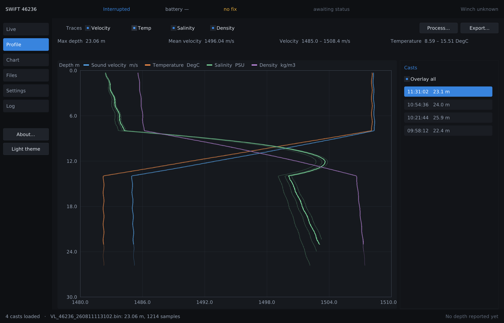
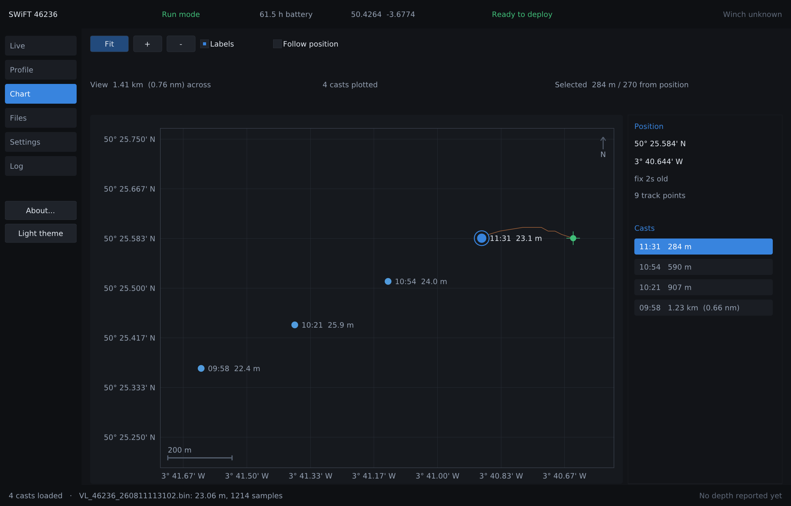

# svpview

Valeport SWiFT profiler acquisition, display and export, with C-MAX Vigo winch
depth reporting. C99 + SDL2, one dependency, no installer.

Replaces **Valeport Ocean** and **VigoDepthRelay** with one program: it
configures the instrument, downloads and plots casts, exports to the survey
formats, and broadcasts each cast's achieved depth to the winch — no
folder-watching shim in between.

It does not control the winch. Casts are commanded from the winch's own web UI
and physical panel, which is where the operator already is and where the
interlocks live; svpview speaks only the profiler UDP protocol on :8090
(`Q`, `V`, `F`). Vigo's TCP :8092 control API is documented in
[docs/VIGO_INTERFACE.md](docs/VIGO_INTERFACE.md) as available and deliberately
unused.



## Status

**Runs; simulator-proven; not yet hardware-proven.** `make test` is 399
assertions across six suites under AddressSanitizer and
UndefinedBehaviorSanitizer. Everything below has been exercised end to end
against a wire-level SWiFT emulator and a stand-in for Vigo's listener — no
real instrument and no real winch have been connected yet. See
[ROADMAP.md](ROADMAP.md) phases 2, 3, 6 and 7, and §11 of the design document
for a plain table of what is proven against what is not.

`plat_win32.c` is not written, so `make windows` does not link yet.

## Quick start

```sh
sudo apt install libsdl2-dev     # Debian/Ubuntu
sudo pacman -S sdl2              # Arch
brew install sdl2                # macOS

make                             # ./svpview
make test                        # every suite, ASan + UBSan
./svpview --sim                  # run against the emulated instrument
```

| Flag / variable | Effect |
|---|---|
| `--sim` | run against the built-in wire-level SWiFT emulator |
| `--open FILE.bin` | load a logged file at startup |
| `--help` | usage |
| `SVPVIEW_SCALE=n` | override the detected HiDPI UI scale |

## What it does

**Instrument** — interrupt, identify, read every setting, return to run mode,
each step with a deadline. Writes send only what changed and read it back to
verify. Browse the card and download, streaming to a temporary file that is
parsed before it is kept; nothing is deleted from the card except on an
explicit operator action.

**Oceanography** — UNESCO 1983 pressure-to-depth with the gravity term at the
cast's own latitude, Chen & Millero sound speed, PSS-78 salinity, EOS-80
density, plus the two numeric inverses a SWiFT SVP needs. Checked against
published values.

**Processing** — down/up-cast split, despike, largest-triangle thinning that
keeps the shape, depth binning.

**Export** — CSV, Valeport VP2, Kongsberg `.asvp`, Caris `.svp`, Hypack
`.vel`. Every file is written to a temp file and renamed into place, so a
machine that loses power mid-write has the old file or the new one, never half
of a sound velocity profile.

**Winch** — `Q` probe, `V` depth report with an incrementing sequence number
(which is what defeats Vigo's identical-message dedupe), and `F` on a failed
download, which is the one and only case where svpview causes the winch to
move. All five of Vigo's silent-drop conditions are mirrored locally, so a
rejection is explained *before* the datagram goes out.

**Chart** — where the casts were taken, in plan.



Cast positions come from each file's header; the live marker and track come
from the `$PVBB` broadcast, which carries four decimal places — about 11 m of
latitude. The two precisions are stated rather than blended, casts logged
without a GPS fix are counted instead of quietly missing, and the live marker
goes hollow with its age shown once it stops being refreshed. There is no
basemap imagery, by decision: no tile server, no internet on a boat, no extra
dependency.

## Documents

| Document | What it covers |
|---|---|
| [docs/svpview_Design_and_Features.pdf](docs/svpview_Design_and_Features.pdf) | Illustrated tour: every page, the design rules and what each costs in code, the protocol findings, and what is proven versus simulator-only |
| [ARCHITECTURE.md](ARCHITECTURE.md) | Layering, modules, why there are no threads, crash-resistance, known unknowns |
| [ROADMAP.md](ROADMAP.md) | Nine implementation phases with done-criteria |
| [CHANGELOG.md](CHANGELOG.md) | Source of truth for release notes, including every bug found during bring-up |
| [docs/SWIFT_PROTOCOL.md](docs/SWIFT_PROTOCOL.md) | SWiFT command codes, sentences, the three binary header variants |
| [docs/VIGO_INTERFACE.md](docs/VIGO_INTERFACE.md) | Vigo profiler UDP protocol, the wire format, and every silent-drop rule |

The design document is self-contained HTML; the PDF is rendered from it with
headless Chrome:

```sh
google-chrome-stable --headless --no-pdf-header-footer \
    --print-to-pdf=docs/svpview_Design_and_Features.pdf \
    --virtual-time-budget=10000 docs/svpview_Design_and_Features.html
```

## Layout

```
src/        sv_ui sv_plot sv_chart sv_theme      UI (SDL2 + Nuklear)
            sv_app sv_sim                       application and emulator
            sv_ocean sv_geo sv_proto sv_binfile  portable core: no SDL, no I/O
            sv_profile sv_export sv_vigo sv_config
            plat_posix                          everything OS-specific
tests/      one suite per core module, always sanitised
third_party/ nuklear.h and its SDL renderer, vendored
docs/       protocol notes, the design document, screenshots
```

The core knows nothing about SDL and does no I/O, which is what makes it
testable. Everything is single-threaded and polled once per frame: at 230400
baud a frame's worth of serial data is under 400 bytes, so a thread per link
would buy nothing measurable and cost a class of race conditions this program
cannot afford. There are no locks anywhere.

## Development notes

- `make test` always builds with ASan and UBSan. A test that only passes
  without them has not passed.
- The Makefile tracks header dependencies (`-MMD -MP`). Without that, changing
  a struct in a header rebuilds some objects and not others, which does not
  fail to link — it silently reads the wrong fields.
- `third_party/nuklear_sdl_renderer.h` carries one local fix: it hard-codes the
  vertex index size as 2 bytes, which is wrong when `NK_UINT_DRAW_INDEX` is
  defined. Marked in the file; worth sending upstream.
- The simulator deliberately does not share arithmetic with the code under
  test. It computes its own sound speed and its own vessel motion, so a test
  cannot pass because both sides made the same mistake.

## Related projects

- `../Vigo` — the winch controller this reports to
- `../SDL_Viewer/files` — `cm2view`, the C + SDL2 + Nuklear app this follows
- `../sonar-fpga/topside` — `sfview`, same house style
